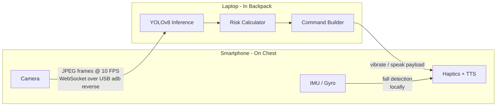

# NavAssist

A software-only navigation assistant for visually impaired users. A smartphone worn on the chest streams camera frames over USB to a laptop in a backpack. The laptop runs real-time object detection and sends haptic and spoken alerts back to the phone — no cloud, no Wi-Fi dependency, no specialised hardware.

---

## Motivation

Existing blind navigation aids either cost thousands of dollars (ultrasonic canes, smart glasses) or rely on cloud APIs that introduce latency and privacy concerns. NavAssist is built entirely from off-the-shelf consumer hardware — a phone and a laptop — connected by a USB cable. The goal is a system that a developer can build, wear, and iterate on in an afternoon.

The Go server specifically targets minimal overhead: a single compiled binary with no runtime dependencies, lower memory footprint, and faster cold-start compared to interpreted alternatives.

---

## How It Works



- The phone captures JPEG frames at ~10 FPS and sends them over a WebSocket tunnelled through `adb reverse` (USB).
- The laptop runs YOLOv8-nano (ONNX) via CGO bindings to ONNX Runtime and classifies each detected object into a hazard tier based on how much of the frame it occupies.
- The laptop sends a `commands` payload back — `vibrate` and/or `speak` — which the phone executes via `expo-haptics` and `expo-speech`.

### Hazard Tiers

| Tier | Bounding box area | Meaning |
|------|------------------|---------|
| `AWARE` | < 15 % of frame | Object in view, not close |
| `CAUTION` | 15–45 % | Approaching, medium buzz |
| `IMMEDIATE` | > 45 % | Very close, strong buzz + spoken alert |

---

## Repository Layout

```
.
├── model/
│   └── yolov8n.onnx                # Generated by tools/setup.ps1 (not committed)
├── server/
│   ├── cmd/server/main.go          # WebSocket server entry point
│   ├── internal/
│   │   ├── inference/
│   │   │   ├── model.go            # ORT session: preprocess → run → postprocess
│   │   │   ├── nms.go              # Greedy NMS with IoU helper
│   │   │   └── classes.go          # 80 COCO class name strings
│   │   └── commands/
│   │       └── builder.go          # Haptic/TTS command builder (3 s debounce)
│   ├── lib/                        # onnxruntime.dll downloaded by start.ps1
│   ├── go.mod
│   └── start.ps1                   # One-command build + run (Windows)
├── tools/
│   ├── export.py                   # YOLOv8 → ONNX export script
│   ├── requirements.txt            # Python dependencies for tools
│   └── setup.ps1                   # Creates venv, installs deps, runs export
└── client/
    ├── App.tsx                     # Root component
    ├── hooks/
    │   ├── useStreamer.ts          # WebSocket + camera capture + command handler
    │   └── useFallDetector.ts      # IMU-based fall detection
    └── components/
        ├── StatsOverlay.tsx        # Live debug overlay (status, FPS, hazard tier)
        ├── FallAlert.tsx           # Fall alert UI
        └── PermissionScreen.tsx    # Camera permission prompt
```

---

## Prerequisites

| Requirement | Notes |
|-------------|-------|
| Windows laptop | PowerShell 5.1+ |
| [Go](https://go.dev/dl/) 1.22+ | Must be on `PATH` |
| [MinGW gcc](https://chocolatey.org/packages/mingw) | Required for CGO — `choco install mingw` (run as Admin) |
| [ADB](https://developer.android.com/tools/releases/platform-tools) | Must be on `PATH` |
| [Python 3.10+](https://python.org/downloads/) | One-time model export only — run `tools\setup.ps1` once |
| `yolov8n.onnx` | Generated by `tools\setup.ps1` into `model/` |

---

## Setup

```powershell
# Connect phone via USB, then forward ports:
adb reverse tcp:8000 tcp:8000
adb reverse tcp:8081 tcp:8081

cd server
.\start.ps1
```

`start.ps1` handles everything automatically:
- Detects gcc (MinGW) and adds it to `PATH` if needed
- Downloads `onnxruntime.dll` v1.20.1 on first run (~8 MB)
- Builds `navassist.exe` with CGO enabled
- Starts the server on `0.0.0.0:8000`

> Run `tools\setup.ps1` once to generate `model/yolov8n.onnx` before starting the server.

> Re-run `adb reverse` every time you reconnect the USB cable.

### Client App

```bash
cd client
npm install
npx expo start
```

Scan the QR code with Expo Go. The app connects to `ws://localhost:8000/ws` (routed over USB) and begins streaming immediately.

### Manual Build

```powershell
cd server
$env:PATH = "C:\ProgramData\mingw64\mingw64\bin;$env:PATH"
$env:CGO_ENABLED = "1"
Remove-Item Env:CC -ErrorAction SilentlyContinue
go build -o navassist.exe .\cmd\server\
.\navassist.exe --model path\to\yolov8n.onnx
```

---

## Tech Stack

| Layer | Technology |
|-------|------------|
| PC server | Go, `net/http`, `gorilla/websocket` |
| Inference | YOLOv8-nano (ONNX), `onnxruntime_go` (CGO) |
| Transport | WebSocket over `adb reverse` (USB) |
| Phone app | React Native (Expo), TypeScript |
| Haptics | `expo-haptics` |
| TTS | `expo-speech` |
| Build toolchain | MinGW gcc, Go 1.22 |

---
