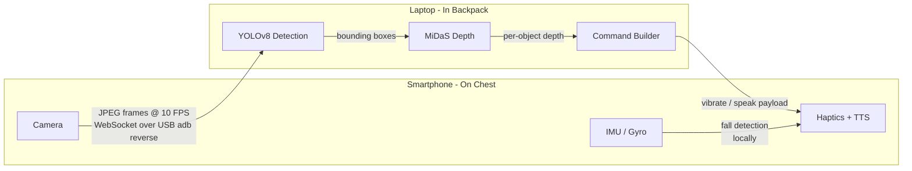

# NavAssist

A software-only navigation assistant for visually impaired users. A smartphone worn on the chest streams camera frames over USB to a laptop in a backpack. The laptop runs real-time object detection with monocular depth estimation and sends haptic and spoken alerts back to the phone — no cloud, no Wi-Fi dependency, no specialised hardware.

## Motivation

Existing blind navigation aids either cost thousands of dollars (ultrasonic canes, smart glasses) or rely on cloud APIs that introduce latency and privacy concerns. NavAssist is built entirely from off-the-shelf consumer hardware — a phone and a laptop — connected by a USB cable. The goal is a system that a developer can build, wear, and iterate on in an afternoon.

The Go server specifically targets minimal overhead: a single compiled binary with no runtime dependencies, lower memory footprint, and faster cold-start compared to interpreted alternatives.

---

## How It Works



- The phone captures JPEG frames at ~10 FPS and sends them over a WebSocket tunnelled through `adb reverse` (USB).
- The laptop runs YOLOv8-nano (ONNX) to detect objects and MiDaS v2.1 (ONNX) to estimate depth. Each bounding box is projected onto the MiDaS depth map and the median closeness value classifies the hazard tier.
- The laptop sends a `commands` payload back — `vibrate` and/or `speak` — which the phone executes via `expo-haptics` and `expo-speech`.
- The phone independently detects falls from IMU data and shows a local alert.

### Hazard Tiers

Tiers are now driven by MiDaS depth (closeness 0–1, where 1 = closest object in frame), not bounding box area:

| Tier | Closeness | Meaning |
|------|-----------|---------|
| `AWARE` | < 0.45 | Object detected, not close |
| `CAUTION` | 0.45–0.75 | Approaching — medium buzz |
| `IMMEDIATE` | > 0.75 | Very close — strong buzz + spoken alert |

When depth is unavailable (model missing), the system falls back to bounding-box area ratio.

### Priority & Debounce

- Detections are sorted by tier → class priority (person > car > bicycle …) → depth.
- The top hazard is spoken at most once every 3 seconds. Haptic feedback fires on every IMMEDIATE or CAUTION frame.

---

## Repository Layout

```
.
├── model/
│   ├── yolov8n.onnx                # Generated by tools/setup.ps1 (not committed)
│   └── midas_small.onnx            # Downloaded by server/start.ps1 on first run
├── server/
│   ├── cmd/server/main.go          # WebSocket server entry point
│   ├── internal/
│   │   ├── inference/
│   │   │   ├── model.go            # YOLOv8 ORT session + AnnotateDepth
│   │   │   ├── depth.go            # MiDaS ORT session, closeness map
│   │   │   ├── nms.go              # Greedy NMS with IoU helper
│   │   │   └── classes.go          # 80 COCO class name strings
│   │   └── commands/
│   │       └── builder.go          # Haptic/TTS command builder (3 s debounce)
│   ├── lib/                        # onnxruntime.dll downloaded by start.ps1
│   ├── go.mod
│   └── start.ps1                   # One-command build + run (Windows)
├── tools/
│   ├── export.py                   # YOLOv8 -> ONNX export script
│   ├── requirements.txt            # Python dependencies for tools
│   └── setup.ps1                   # Creates venv, installs deps, runs export
└── client/
    ├── App.tsx                     # Root component
    ├── hooks/
    │   ├── useStreamer.ts          # WebSocket + camera capture + command handler
    │   └── useFallDetector.ts      # IMU-based fall detection
    └── components/
        ├── StatsOverlay.tsx        # Live debug overlay (status, FPS, hazard, depth)
        ├── FallAlert.tsx           # Fall alert UI
        └── PermissionScreen.tsx    # Camera permission prompt
```

## Prerequisites

| Requirement | Notes |
|-------------|-------|
| Windows laptop | PowerShell 5.1+ |
| [Go](https://go.dev/dl/) 1.22+ | Must be on `PATH` |
| [MinGW gcc](https://chocolatey.org/packages/mingw) | Required for CGO — `choco install mingw` (run as Admin) |
| [ADB](https://developer.android.com/tools/releases/platform-tools) | Must be on `PATH` |
| [Python 3.10+](https://python.org/downloads/) | One-time model export only |
| [Expo Go](https://expo.dev/go) | Installed on phone |
| USB Debugging | Settings → Developer Options → USB Debugging |

---

## Setup

### Step 1 — Export the YOLO model (first time only)

```powershell
cd tools
.\setup.ps1
```

Creates a Python venv, installs `ultralytics`, exports `yolov8n.onnx` into `model/`, then cleans up. Takes ~2 minutes on first run.

### Step 2 — Connect phone via USB

Plug the phone into the PC. Accept the "Allow USB Debugging?" popup on the phone.

```powershell
adb reverse tcp:8000 tcp:8000
adb reverse tcp:8081 tcp:8081
```

> Re-run these every time you reconnect the USB cable.

### Step 3 — Start the Go server

```powershell
cd server
.\start.ps1
```

`start.ps1` handles everything automatically:
- Detects gcc (MinGW) and adds it to `PATH` if needed
- Downloads `onnxruntime.dll` v1.20.1 on first run (~8 MB)
- Downloads `midas_small.onnx` on first run (~80 MB)
- Builds `navassist.exe` with CGO enabled
- Starts the server on `0.0.0.0:8000`

Expected output:
```
depth model loaded path=../model/midas_small.onnx
model loaded path=../model/yolov8n.onnx
server listening addr=0.0.0.0:8000/ws
```

### Step 4 — Start the Expo dev server

```powershell
cd client
npm install
npx expo start
```

Scan the QR code with Expo Go. First bundle takes ~60 s.

### Step 5 — Verify

| Check | Where | Expected |
|-------|-------|----------|
| Status | Phone screen | `Connected ✓` |
| RTT latency | Phone screen | `< 200 ms` |
| FPS | Phone screen | `2–5 FPS` |
| Hazard display | Phone screen | e.g. `CAUTION - laptop (72% close)` |

If **Status** stays at `Connecting…`, re-run Step 2 and reload Expo Go.

### Manual Build

```powershell
cd server
$env:PATH = "C:\ProgramData\mingw64\mingw64\bin;$env:PATH"
$env:CGO_ENABLED = "1"
Remove-Item Env:CC -ErrorAction SilentlyContinue
go build -o navassist.exe .\cmd\server\
.\navassist.exe --model ..\model\yolov8n.onnx --depth-model ..\model\midas_small.onnx
```

## Tech Stack

| Layer | Technology |
|-------|------------|
| PC server | Go, `net/http`, `gorilla/websocket` |
| Object detection | YOLOv8-nano (ONNX), `onnxruntime_go` (CGO) |
| Depth estimation | MiDaS v2.1 small (ONNX), same ORT runtime |
| Transport | WebSocket over `adb reverse` (USB) |
| Phone app | React Native (Expo), TypeScript |
| Haptics | `expo-haptics` |
| TTS | `expo-speech` |
| Build toolchain | MinGW gcc, Go 1.22 |