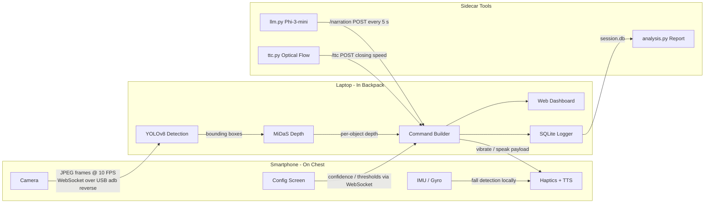

# NavAssist

A software-only navigation assistant for visually impaired users. A smartphone worn on the chest streams camera frames over USB to a laptop in a backpack. The laptop runs real-time object detection with monocular depth estimation and sends haptic and spoken alerts back to the phone — no cloud, no Wi-Fi dependency, no specialised hardware.

## Motivation

Existing blind navigation aids either cost thousands of dollars (ultrasonic canes, smart glasses) or rely on cloud APIs that introduce latency and privacy concerns. NavAssist is built entirely from off-the-shelf consumer hardware — a phone and a laptop — connected by a USB cable.

---

## How It Works



- The phone captures JPEG frames at ~10 FPS and sends them over a WebSocket tunnelled through `adb reverse` (USB).
- The laptop runs YOLOv8-nano (ONNX) for detection and MiDaS v2.1 (ONNX) for per-pixel depth. The median closeness value per bounding box determines the hazard tier.
- The laptop sends a `commands` payload back — `vibrate` and/or `speak` — executed by the phone via `expo-haptics` and `expo-speech`.
- The phone independently detects falls from IMU data and POSTs to `/fall`; the server can trigger an emergency SMS via Twilio.
- A live web dashboard at `http://localhost:8000/dashboard` shows bounding boxes, FPS, and tier badges.
- An optional Phi-3-mini sidecar generates spoken scene summaries every 5 s.

### Hazard Tiers

Tiers are driven by MiDaS depth (closeness 0—1, where 1 = closest object in frame):

| Tier | Closeness | Behaviour |
|------|-----------|-----------|
| `AWARE` | < 0.45 | Object detected, not close |
| `CAUTION` | 0.45—0.75 | Medium buzz |
| `IMMEDIATE` | > 0.75 | Strong buzz + spoken alert |

When MiDaS is unavailable the system falls back to bounding-box area ratio.

### Priority & Debounce

- Detections are sorted by tier → class priority (person > car > bicycle ...) → depth.
- The top hazard is spoken at most once every 3 seconds. Haptic feedback fires on every IMMEDIATE or CAUTION frame.
- Thresholds (confidence, immClose, cautClose) are configurable from the phone and take effect immediately.

---

## Repository Layout

```
.
├── model/
│   ├── yolov8n.onnx                # Generated by tools/setup.ps1 (not committed)
│   └── midas_small.onnx            # Downloaded by server/start.ps1 on first run
├── server/
│   ├── cmd/
│   │   ├── server/main.go          # WebSocket server entry point
│   │   └── replay/main.go          # Offline replay of recorded sessions
│   ├── internal/
│   │   ├── inference/
│   │   │   ├── model.go            # YOLOv8 ORT session + AnnotateDepth
│   │   │   ├── depth.go            # MiDaS ORT session, closeness map
│   │   │   ├── nms.go              # Greedy NMS with IoU helper
│   │   │   └── classes.go          # 80 COCO class names
│   │   ├── commands/builder.go     # Haptic/TTS command builder (3 s debounce)
│   │   ├── dashboard/              # Embedded HTML for /dashboard
│   │   ├── logger/logger.go        # SQLite hazard event logger
│   │   └── metrics/metrics.go      # Prometheus counters / histograms
│   ├── lib/                        # onnxruntime.dll (downloaded by start.ps1)
│   ├── go.mod
│   └── start.ps1                   # One-command build + run (Windows)
├── client/
│   ├── App.tsx                     # Root component
│   ├── hooks/
│   │   ├── useStreamer.ts          # WebSocket + camera capture + command handler
│   │   ├── useFallDetector.ts      # IMU-based fall detection
│   │   ├── useConfig.ts            # AsyncStorage config persistence
│   │   └── useSessionLog.ts        # expo-sqlite hazard log
│   └── components/
│       ├── StatsOverlay.tsx        # Live debug overlay (FPS, tier, depth)
│       ├── ConfigScreen.tsx        # Settings UI (confidence, thresholds, TTS rate)
│       ├── FallAlert.tsx           # Fall alert with countdown
│       └── PermissionScreen.tsx    # Camera permission prompt
└── tools/
    ├── export.py                   # YOLOv8 -> ONNX export
    ├── llm.py                      # Phi-3-mini scene narrator sidecar
    ├── ttc.py                      # Time-to-collision via optical flow
    ├── analysis.py                 # Post-session HTML report + heatmap
    ├── report_template.html        # Report template
    └── requirements.txt            # Python deps for all tools
```

---

## Server Endpoints

| Endpoint | Method | Description |
|----------|--------|-------------|
| `/ws` | WS | Main WebSocket — frames in, commands out |
| `/status` | GET | Latest snapshot: FPS, detections, tier |
| `/frame` | GET | Latest JPEG frame (used by ttc.py) |
| `/dashboard` | GET | Live HTML dashboard |
| `/metrics` | GET | Prometheus metrics |
| `/fall` | POST | Fall event from phone; triggers Twilio SMS if configured |
| `/narration` | POST | LLM-generated scene text; forwarded to phone TTS |
| `/ttc` | POST | Closing-speed estimate from ttc.py |

---

## Prerequisites

| Requirement | Notes |
|-------------|-------|
| Windows laptop | PowerShell 5.1+ |
| [Go](https://go.dev/dl/) 1.22+ | Must be on `PATH` |
| [MinGW gcc](https://www.msys2.org/) | Required for CGO — `pacman -S mingw-w64-x86_64-gcc` |
| [ADB](https://developer.android.com/tools/releases/platform-tools) | Must be on `PATH` |
| [Python 3.10+](https://python.org/downloads/) | For tools (model export, LLM, analysis) |
| [Expo Go](https://expo.dev/go) | Installed on phone |
| USB Debugging | Settings -> Developer Options -> USB Debugging |

---

## Setup & Run

### Step 1 — Export the YOLO model (first time only)

```powershell
cd tools
.\setup.ps1
```

Creates a Python venv, installs `ultralytics`, exports `yolov8n.onnx` into `model/`.

### Step 2 — Connect phone via USB

```powershell
adb reverse tcp:8000 tcp:8000
adb reverse tcp:8081 tcp:8081
```

Re-run these every time you reconnect the USB cable.

### Step 3 — Start the Go server

```powershell
cd server
.\start.ps1
```

`start.ps1` automatically:
- Adds MinGW gcc to `PATH` if found at common MSYS2 paths
- Downloads `onnxruntime.dll` v1.20.1 on first run (~8 MB)
- Downloads `midas_small.onnx` on first run (~80 MB)
- Builds and starts `navassist.exe` on `0.0.0.0:8000`

Expected output:
```
depth model loaded path=../model/midas_small.onnx
model loaded path=../model/yolov8n.onnx
session log opened path=session.db
server listening addr=0.0.0.0:8000/ws
```

To enable frame recording (needed for replay):
```powershell
.\navassist.exe --record ..\recordings\session1
```

### Step 4 — Start the Expo dev server

```powershell
cd client
npm install
npx expo start
```

Scan the QR code with Expo Go. First bundle takes ~60 s.

### Step 5 — Verify core system

| Check | Where | Expected |
|-------|-------|----------|
| Status | Phone screen | `Connected` |
| RTT latency | Phone screen | `< 200 ms` |
| FPS | Phone screen | `2-5 FPS` |
| Hazard display | Phone screen | e.g. `CAUTION - laptop (72% close)` |
| Dashboard | `http://localhost:8000/dashboard` | Live bounding box canvas |
| Metrics | `http://localhost:8000/metrics` | Prometheus text |

---

## Optional Sidecars

### LLM Scene Narration

Requires a Phi-3-mini GGUF from [HuggingFace](https://huggingface.co/microsoft/Phi-3-mini-4k-instruct-gguf).

```powershell
cd tools
pip install llama-cpp-python requests
python llm.py --model path\to\Phi-3-mini.gguf
```

Every 5 s it fetches `/status`, generates a spoken sentence, and POSTs to `/narration`. The phone speaks it aloud.

Optional flags: `--server http://localhost:8000`, `--interval 5.0`, `--threads 4`

### Time-to-Collision Estimator

```powershell
cd tools
pip install opencv-python numpy requests
python ttc.py
```

Polls `/frame`, runs Farneback optical flow, and POSTs closing speed to `/ttc`.

### Emergency SMS on Fall

Set environment variables before starting the server:

```powershell
$env:TWILIO_SID   = "ACxxxxxxxxxxxxxxxxxxxxxxxxxxxxxxxx"
$env:TWILIO_TOKEN = "your_auth_token"
$env:TWILIO_FROM  = "+15550001111"
$env:TWILIO_TO    = "+15550002222"
.\navassist.exe
```

When the phone detects a fall and POSTs to `/fall`, the server sends an SMS.

---

## Post-Session Analysis

After a session, `session.db` is written in `server/`.

```powershell
cd tools
pip install -r requirements.txt
python analysis.py --db ..\server\session.db --out report.html
start report.html
```

Generates a standalone HTML report with tier distribution, top-10 hazard labels, recent event timeline, and a GPS heatmap (when the client logged location).

### Session Replay

Re-runs YOLO inference on a recorded session and prints per-frame comparisons:

```powershell
cd server
go run .\cmd\replay\ -dir ..\recordings\session1
```

---

## Tech Stack

| Layer | Technology |
|-------|------------|
| PC server | Go 1.22, `net/http`, `gorilla/websocket` |
| Object detection | YOLOv8-nano (ONNX), `onnxruntime_go` (CGO) |
| Depth estimation | MiDaS v2.1 small (ONNX), same ORT runtime |
| Observability | Prometheus (`/metrics`), SQLite session log |
| Dashboard | Embedded HTML served at `/dashboard` |
| Transport | WebSocket over `adb reverse` (USB) |
| Phone app | React Native (Expo), TypeScript |
| Haptics | `expo-haptics` |
| TTS | `expo-speech` |
| Config persistence | `expo-sqlite`, `AsyncStorage` |
| LLM narration | Phi-3-mini via `llama-cpp-python` (optional) |
| Optical flow | OpenCV Farneback (optional) |
| Analysis | SQLite + folium heatmap |
| Build toolchain | MinGW gcc, Go 1.22 |
