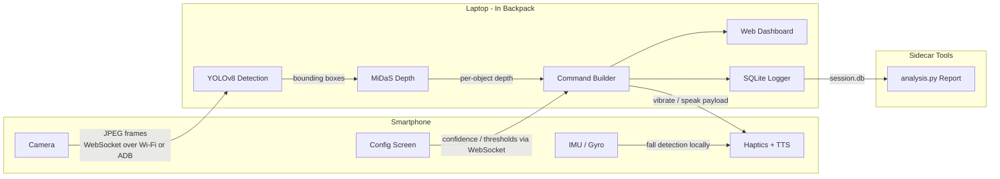

#  NavAssist
[](https://github.com/waitasecant/nav-assist/releases/latest)
[](https://github.com/waitasecant/nav-assist/actions/workflows/ci.yml)
[](https://github.com/waitasecant/nav-assist/actions/workflows/nightly.yml)


[](LICENSE)

A software-only navigation assistant for visually impaired users. A smartphone streams camera frames wirelessly to a laptop in a backpack. The laptop runs real-time object detection with monocular depth estimation and sends haptic and spoken alerts back to the phone — no cloud, no specialised hardware.

## Motivation

Existing blind navigation aids either cost thousands of dollars (ultrasonic canes, smart glasses) or rely on cloud APIs that introduce latency and privacy concerns. NavAssist is built entirely from off-the-shelf consumer hardware — a phone and a laptop — connected over Wi-Fi (mDNS auto-discovery, no setup) or ADB (Wi-Fi or USB cable for lower latency).

---

## How It Works


```mermaid
graph LR
    subgraph Phone [Smartphone]
        CAM[Camera]
        IMU[IMU / Gyro]
        FB[Haptics + TTS]
        CFG[Config Screen]
    end

    subgraph PC [Laptop - In Backpack]
        YOLO[YOLOv8 Detection]
        MIDAS[MiDaS Depth]
        CMD[Command Builder]
        DASH[Web Dashboard]
        LOG[SQLite Logger]
    end

    subgraph Tools [Sidecar Tools]
        ANA[analysis.py Report]
    end

    CAM -->|JPEG frames\nWebSocket over Wi-Fi or ADB| YOLO
    YOLO -->|bounding boxes| MIDAS
    MIDAS -->|per-object depth| CMD
    CMD -->|vibrate / speak payload| FB
    IMU -->|fall detection locally| FB
    CFG -->|confidence / thresholds via WebSocket| CMD
    CMD --> LOG
    CMD --> DASH
    LOG -->|session.db| ANA
```

- The phone captures JPEG frames from a 720p-capped preview buffer and sends them over a WebSocket — either over Wi-Fi (mDNS auto-discovery) or ADB (Wi-Fi or USB).
- Frame rate adapts dynamically to server round-trip time; the server sends a `max_in_flight` limit on connect so the client can pipeline multiple frames simultaneously.
- The laptop runs YOLOv8-nano INT8 at 320px input (ONNX) for detection and MiDaS v2.1 small (ONNX) for per-pixel depth estimation. The median closeness value per bounding box determines the hazard tier.
- Inference runs on the best available backend: CUDA EP (NVIDIA), DirectML EP (any DX12 GPU), or CPU.
- The laptop sends a `commands` payload back — `vibrate` and/or `speak` — executed by the phone via `expo-haptics` and `expo-speech`.
- The phone independently detects falls from IMU data and POSTs to `/fall`; the server can trigger an emergency SMS via Twilio.
- A live web dashboard at `http://localhost:8000/dashboard` shows bounding boxes, FPS, and tier badges.

### Hazard Tiers

Tiers are driven by MiDaS depth (closeness 0—1, where 1 = closest object in frame):

| Tier | Closeness | Behaviour |
|------|-----------|-----------|
| `AWARE` | < 0.45 | Object detected, not close |
| `CAUTION` | 0.45—0.75 | Medium buzz |
| `IMMEDIATE` | > 0.75 | Strong buzz + spoken alert |

When MiDaS is unavailable the system falls back to bounding-box area ratio.

### Priority & Debounce

- Detections are sorted by tier -> class priority (person > car > bicycle ...) -> depth.
- The top hazard is spoken at most once every 3 seconds. Haptic feedback fires on every IMMEDIATE or CAUTION frame.
- Thresholds (confidence, immClose, cautClose) are configurable from the phone and take effect immediately.

---

## Repository Layout

```
.
├── model/
│   ├── yolov8n.onnx                        # FP32 model — generated by tools/setup.ps1 (not committed)
│   ├── yolov8n_int8.onnx                   # INT8 model — generated by tools/setup.ps1 --quantize
│   └── midas_small.onnx                    # Downloaded by server/start.ps1 on first run
├── server/
│   ├── cmd/
│   │   ├── server/main.go                  # WebSocket server entry point
│   │   └── replay/main.go                  # Offline replay of recorded sessions
│   ├── internal/
│   │   ├── adb/adb.go                      # Auto adb reverse tunnel (Wi-Fi or USB)
│   │   ├── inference/
│   │   │   ├── model.go                    # YOLOv8 ORT session + AnnotateDepth
│   │   │   ├── depth.go                    # MiDaS ORT session, closeness map
│   │   │   ├── nms.go                      # Greedy NMS with IoU helper
│   │   │   └── classes.go                  # 80 COCO class names
│   │   ├── commands/builder.go             # Haptic/TTS command builder (3 s debounce)
│   │   ├── dashboard/                      # Embedded HTML for /dashboard
│   │   ├── logger/logger.go                # SQLite hazard event logger
│   │   └── metrics/metrics.go              # Prometheus counters / histograms
│   ├── lib/                                # ORT runtime DLLs: CPU, DirectML, CUDA (downloaded by start.ps1)
│   ├── go.mod
│   ├── .golangci.yml                       # Linter config
│   └── start.ps1                           # One-command build + run (Windows)
├── client/
│   ├── app.json                            # Expo app manifest
│   ├── eas.json                            # EAS Build config
│   ├── index.ts                            # Entry point
│   ├── App.tsx                             # Root component (SafeAreaProvider, camera, modal wiring)
│   ├── package.json                        # npm dependencies and Expo scripts
│   ├── tsconfig.json                       # TypeScript compiler config (strict, Expo preset)
│   ├── assets/                             # App icons and splash screen images
│   ├── hooks/
│   │   ├── useStreamer.ts                  # WebSocket + camera capture + command handler
│   │   ├── useFallDetector.ts              # IMU-based fall detection (enable/disable via config)
│   │   ├── useConfig.ts                    # AsyncStorage config persistence
│   │   ├── useSessionLog.ts                # expo-sqlite hazard event log with aggregate queries
│   │   ├── useDashboard.ts                 # Polls session DB every 5 s; exposes history data
│   │   └── useDiscovery.ts                 # mDNS server auto-discovery
│   ├── components/
│   │   ├── StatsOverlay.tsx                # Status dot (green/red) + live hazard text
│   │   ├── DashboardScreen.tsx             # In-app dashboard: live stats + event history
│   │   ├── ConfigScreen.tsx                # Settings UI
│   │   ├── FallAlert.tsx                   # Fall alert with countdown
│   │   └── PermissionScreen.tsx            # Camera permission prompt
│   ├── plugins/
│   │   └── withNetworkSecurityConfig.js    # Expo config plugin for Android network policy
│   └── types/
│       └── react-native-zeroconf.d.ts      # Type declarations for mDNS library
└── tools/
    ├── export.py                           # YOLOv8 -> ONNX export (FP32 + optional INT8 via --quantize)
    ├── analysis.py                         # Post-session HTML report + heatmap
    ├── smoke_test.py                       # End-to-end smoke test
    ├── setup.ps1                           # Python venv + dependency setup (Windows)
    ├── report_template.html                # Report template
    └── requirements.txt                    # Python deps for all tools
```

---

## Server Endpoints

| Endpoint | Method | Description |
|----------|--------|-------------|
| `/ws` | WS | Main WebSocket — frames in, commands out |
| `/status` | GET | Latest snapshot: FPS, detections, tier |
| `/dashboard` | GET | Live HTML dashboard |
| `/metrics` | GET | Prometheus metrics |
| `/fall` | POST | Fall event from phone; triggers Twilio SMS if configured |

---

## Releases

Each `v*` tag triggers a GitHub Actions release that publishes pre-built artifacts — no Go toolchain or EAS account needed to run the system.

| Artifact | Use |
|----------|-----|
| `navassist-server-linux-amd64.zip` | Laptop (Linux x64) — unzip, run binary |
| `navassist-server-linux-arm64.zip` | Raspberry Pi 4/5 — server on the Pi, phone on Wi-Fi |
| `navassist-server-windows-amd64.zip` | Laptop (Windows) — unzip, run binary |
| `navassist.apk` | Sideload directly onto phone |
| `yolov8n.onnx`, `yolov8n_int8.onnx` | FP32 and INT8 YOLO models — auto-downloaded on first launch |
| `midas_small.onnx` | Depth model — auto-downloaded on first launch |

### Quick start (no source required)

Go to the [latest release](https://github.com/waitasecant/nav-assist/releases/latest) and download the server bundle for your platform and `navassist.apk`.

**Option A: Wi-Fi / mDNS**

1. Unzip the server bundle and run it — models download automatically on first launch:
   ```powershell
   .\navassist-server.exe
   ```
2. On your phone, open the release page in a browser, download `navassist.apk`, and install it (enable *Install from unknown sources* when prompted).
3. Connect phone and laptop to the **same Wi-Fi network**.
4. Open the app — it discovers the server automatically via mDNS. Grant camera permission and start streaming.

**Option B: ADB Wi-Fi (lower latency than mDNS)**

Requires Android 11+ and ADB installed on the laptop.

1. Run the server as in Option A.
2. On the phone: *Settings -> Developer Options -> Wireless debugging -> enable*.
3. Tap **Pair device with pairing code** — note the IP, pairing port, and 6-digit code shown on screen.
4. On the laptop, pair once:
   ```powershell
   adb pair 192.168.x.x:37891   # use your phone's IP and pairing port
   # Enter the 6-digit pairing code when prompted
   ```
5. Back on the phone, note the connection port shown on the main *Wireless debugging* screen (different from the pairing port).
6. Connect:
   ```powershell
   adb connect 192.168.x.x:43335   # use your phone's IP and connection port
   adb devices                      # should show: 192.168.x.x:43335  device
   ```
7. Open the app — the server sets up `adb reverse` automatically and the app connects.

The device stays paired; you only need to repeat `adb connect` after rebooting the phone.

**Option C: USB cable (lowest latency)**

1. Run the server as in Option A.
2. Enable *USB Debugging* on the phone (*Developer Options -> USB Debugging*), connect the cable, and accept the trust prompt.
3. Install the APK:
   ```powershell
   adb install navassist.apk
   adb devices   # should show your device
   ```
4. Open the app — the server sets up `adb reverse` automatically and the app connects.

---

## Prerequisites

| Requirement | Notes |
|-------------|-------|
| Windows laptop | PowerShell 5.1+ |
| [Go](https://go.dev/dl/) 1.22+ | Must be on `PATH` |
| [MinGW gcc](https://www.msys2.org/) | Required for CGO — `pacman -S mingw-w64-x86_64-gcc` |
| [ADB](https://developer.android.com/tools/releases/platform-tools) | Must be on `PATH` |
| [Python 3.10+](https://python.org/downloads/) | For tools (model export, analysis) |
| Wireless debugging | *Settings -> Developer Options -> Wireless debugging* (Android 11+) |
| CUDA Toolkit 12.x *(optional)* | NVIDIA GPU only — enables CUDA EP; `start.ps1` installs cuDNN automatically |

---

## Setup & Run

### Step 1 : Export the YOLO model (first time only)

```powershell
cd tools
.\setup.ps1
```

Creates a Python venv, installs `ultralytics`, exports `yolov8n.onnx` and `yolov8n_int8.onnx` into `model/`.

### Step 2 : Connect phone via ADB

**ADB Wi-Fi:** pair once, then connect:
```powershell
adb pair 192.168.x.x:37891    # IP and pairing port from phone's "Pair using pairing code" screen
adb connect 192.168.x.x:43335 # IP and connection port from main Wireless debugging screen
```

**USB cable:** connect the cable and accept the trust prompt.

Port 8000 (`/ws`) is reversed automatically by the server on startup.

### Step 3 : Start the Go server

```powershell
cd server
.\start.ps1
```

`start.ps1` automatically:
- Detects GPU: NVIDIA -> CUDA EP, other GPU -> DirectML EP, none -> CPU
- Downloads the appropriate ORT runtime DLL on first run
- For NVIDIA: detects CUDA Toolkit and installs cuDNN via pip if missing
- Selects INT8 model if available, falls back to FP32
- Adds MinGW gcc to `PATH` if found at common MSYS2 paths
- Downloads `midas_small.onnx` on first run
- Builds and starts `navassist.exe` on `0.0.0.0:8000`

Optional flags:
```powershell
.\start.ps1 -ForceCPU        # disable GPU acceleration
.\start.ps1 -ForceDirectML   # DirectML even on NVIDIA (skip CUDA)
```

Expected output:
```
depth model loaded path=../model/midas_small.onnx
model loaded path=../model/yolov8n.onnx
session log opened path=session.db
server listening addr=0.0.0.0:8000/ws
```

To enable frame recording (needed for replay):
```powershell
.\navassist.exe --record ..\recordings\session1
```

### Step 4 : Build and install the Android APK

```powershell
cd client

# First time or after adding/removing native packages
npx expo prebuild --platform android

# Build release APK
cd android
.\gradlew assembleRelease

# Install on connected phone (phone must be connected via ADB)
adb install -r app\build\outputs\apk\release\app-release.apk
```

The APK connects to the server automatically via mDNS or ADB tunnel — no Expo Go needed.

### Step 5 : Verify core system

| Check | Where | Expected |
|-------|-------|----------|
| Status | Phone screen | `Connected` |
| RTT latency | Phone screen | Low (varies with laptop hardware and GPU) |
| Server FPS | Phone screen | Varies with GPU; higher is better |
| Hazard display | Phone screen | e.g. `CAUTION - laptop (72% close)` |
| Dashboard | `http://localhost:8000/dashboard` | Live bounding box canvas |
| Metrics | `http://localhost:8000/metrics` | Prometheus text |

---

## Emergency SMS on Fall

The phone detects a fall via IMU. If the user does not dismiss the alert within the countdown, the app POSTs to `/fall` with the device's GPS coordinates. The server sends an SMS via Twilio.

**Set the emergency contact in the app** (Account screen) — this is the SMS recipient. The number is sent to the server over the WebSocket connection.

Set Twilio credentials as environment variables before starting the server:

```powershell
$env:TWILIO_SID   = "ACxxxxxxxxxxxxxxxxxxxxxxxxxxxxxxxx"
$env:TWILIO_TOKEN = "your_auth_token"
$env:TWILIO_FROM  = "+91 XXX XXX XXXX"   # your Twilio number
.\start.ps1
```

`TWILIO_TO` can optionally be set as a server-side fallback if no emergency contact is configured in the app:

```powershell
$env:TWILIO_TO = "+91 XXX XXX XXXX"
```

---

## Post-Session Analysis

After a session, `session.db` is written in `server/`.

```powershell
cd tools
pip install -r requirements.txt
python analysis.py --db ..\server\session.db --out report.html
start report.html
```

Generates a standalone HTML report with tier distribution, top-10 hazard labels, recent event timeline, and a GPS heatmap (when the client logged location).

### Session Replay

Re-runs YOLO inference on a recorded session and prints per-frame comparisons:

```powershell
cd server
go run .\cmd\replay\ -dir ..\recordings\session1
```

---

## Tech Stack

| Layer | Technology |
|-------|------------|
| PC server | Go 1.25, `net/http`, `gorilla/websocket` |
| Object detection | YOLOv8-nano 320px INT8 (ONNX), `onnxruntime_go` (CGO) |
| Depth estimation | MiDaS v2.1 small (ONNX), same ORT runtime |
| GPU acceleration | CUDA EP (NVIDIA), DirectML EP (any DX12 GPU), CPU fallback |
| Observability | Prometheus (`/metrics`), SQLite session log |
| Dashboard | Embedded HTML served at `/dashboard` |
| Transport | WebSocket over Wi-Fi (mDNS auto-discovery) or ADB (Wi-Fi or USB) |
| Server mDNS | `grandcat/zeroconf` |
| Phone app | React Native 0.86 (Expo 57), TypeScript |
| Camera | `react-native-vision-camera` v4 |
| IMU / Fall detection | `expo-sensors` (accelerometer) |
| Haptics | `expo-haptics` |
| TTS | `expo-speech` |
| Location | `expo-location` (GPS for fall events) |
| Client mDNS discovery | `react-native-zeroconf` |
| Native file I/O | `react-native-blob-util` |
| Config persistence | `expo-sqlite`, `AsyncStorage` |
| UI icons | `@expo/vector-icons` (Ionicons) |
| Safe area | `react-native-safe-area-context` |
| Analysis | Python, SQLite, folium heatmap |
| Build toolchain | MinGW gcc, Go 1.25, Expo prebuild + Gradle |
