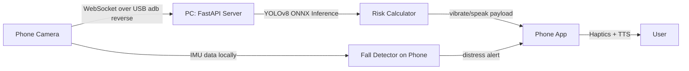

# NavAssist — Software-Only Blind Navigation System

## Architecture Summary

```
+----------------------------------------+               +----------------------------------------+
|          Smartphone (On Chest)         |               |       Snapdragon AI PC (In Backpack)   |
|                                        |               |                                        |
|  1. Streams Video Feed -----------(USB / adb)------->  |  1. Runs NPU-Accelerated YOLOv8        |
|  2. Collects IMU/Gyro Data             |               |  2. Calculates Object Distance/Risk    |
|                                        |  <---(Socket)-+  3. Maps Context to Action             |
|  3. Fires Native Vibrate (Haptics)     |               +----------------------------------------+
|  4. Plays Audio UI (Earbuds via TTS)   |
+----------------------------------------+
```



---

## Phase 1 — Network Bridge ✅

**Goal:** Establish a reliable USB-tunnelled link between phone and PC.

> **Transport:** WebSocket over `adb reverse` (USB). Phone is the Wi-Fi hotspot for internet; all app↔server traffic travels over the USB cable, bypassing corporate firewall restrictions.

| # | Task | Detail | Status |
|---|------|--------|--------|
| 1.1 | Use phone as Wi-Fi hotspot | PC connects to phone's hotspot for internet; PC hotspot not needed | ✅ Done |
| 1.2 | Enable adb reverse tunnel | `adb reverse tcp:8000 tcp:8000` + `tcp:8081 tcp:8081` — re-run on each reconnect | ✅ Done |
| 1.3 | Write FastAPI server skeleton | WebSocket `/ws` for bidirectional control; server binds to `0.0.0.0:8000` | ✅ Done |
| 1.4 | Write phone-side camera streamer | Expo app connects to `ws://localhost:8000/ws`; pushes JPEG frames at ~10 FPS | ✅ Done |
| 1.5 | Verify round-trip latency | RTT computed from timestamp echo; target < 150 ms | ✅ Done |

**Deliverable:** Phone streams frames over USB, PC echoes them back — latency < 150 ms. ✅

---

## Phase 2 — The Brain (NPU Inference)

**Goal:** Run YOLOv8-nano on incoming frames, compute hazard level.

| # | Task | Detail |
|---|------|--------|
| 2.1 | Export YOLOv8-nano to ONNX | `yolo export model=yolov8n.pt format=onnx imgsz=640` |
| 2.2 | Set up `onnxruntime` with Qualcomm EP | Install `onnxruntime-qnn` or fall back to `onnxruntime` CPU/GPU |
| 2.3 | Write inference loop | Grab frame from WebSocket → preprocess → run ONNX → parse bounding boxes |
| 2.4 | Implement bounding-box area rule | If `(box_w * box_h) / (frame_w * frame_h) > 0.45` → flag `IMMEDIATE_HAZARD` |
| 2.5 | Classify distance tiers | `> 45%` = Immediate, `15–45%` = Caution, `< 15%` = Aware |

**Deliverable:** PC prints detected objects with distance tier labels in real time.

---

## Phase 3 — Feedback Loop

**Goal:** Close the loop — hazards trigger haptics and audio.

| # | Task | Detail |
|---|------|--------|
| 3.1 | Define command protocol | JSON payloads: `{"action":"vibrate","intensity":"high"}` / `{"action":"speak","text":"Car ahead"}` |
| 3.2 | Send commands over WebSocket | PC pushes payload to phone's open WebSocket connection after each inference frame |
| 3.3 | Phone: implement haptic handler | Android: `Vibrator` API / iOS: `UIImpactFeedbackGenerator`; map intensity → pattern |
| 3.4 | Phone: implement TTS handler | Android: `TextToSpeech` / iOS: `AVSpeechSynthesizer`; speak text from payload |
| 3.5 | (Optional) PC-side TTS fallback | `pyttsx3` on PC for debugging without phone present |

**Deliverable:** Walking toward a chair triggers chest vibration + "obstacle ahead" in earbuds.

---

## Phase 4 — Fall Detection (Phone-Only)

**Goal:** Locally detect a fall without needing PC involvement.

| # | Task | Detail |
|---|------|--------|
| 4.1 | Subscribe to accelerometer in app | Use `expo-sensors` (React Native) or `sensors_plus` (Flutter) at ~100 Hz |
| 4.2 | Implement fall detection heuristic | Spike: `\|a\| > 2.5g` for >50 ms **then** `\|a\| < 0.3g` for >1 s → fall confirmed |
| 4.3 | Fire distress alert locally | Bypass PC; immediately trigger TTS "Fall detected, are you okay?" + aggressive vibration |
| 4.4 | Add confirmation cancel | 5-second countdown that user can tap to dismiss (avoids false positives) |

**Deliverable:** Drop phone on a cushion → distress alert fires within 2 seconds.

---

## Phase 5 — Integration & Daily Deployment

| # | Task | Detail |
|---|------|--------|
| 5.1 | Power / startup script | Single `.bat`/`.ps1` on PC: starts hotspot → waits for phone IP → launches FastAPI |
| 5.2 | PC sleep prevention | Windows Power Options → "When I close the lid: Do nothing" |
| 5.3 | Phone mount setup | Chest harness or shoulder-strap armband, camera forward-facing |
| 5.4 | End-to-end field test | Walk a 5-min urban route, log false positive/negative rates |
| 5.5 | Tune thresholds | Adjust the `0.45` area threshold and fall G-force values based on field data |

---

## Tech Stack

| Layer | Technology |
|-------|-----------|
| PC server | Python, FastAPI, `websockets` |
| Inference | `onnxruntime` (QNN EP on Snapdragon) |
| Model | YOLOv8-nano (ONNX export) |
| Phone app | React Native (Expo) or Flutter |
| Phone sensors | Camera, Accelerometer, Vibrator, TTS |
| Transport | Local WebSocket over Wi-Fi hotspot |

---

## Build Order

Phase 1 → Phase 2 → Phase 3 → Phase 4 → Phase 5

Each phase is independently testable before the next begins.
