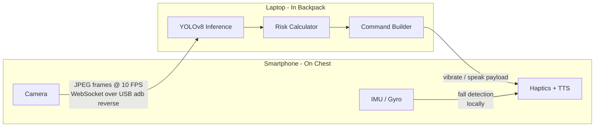

# NavAssist

A software-only navigation assistant for visually impaired users. A smartphone worn on the chest streams camera frames over USB to a laptop in a backpack. The laptop runs real-time object detection and sends haptic and spoken alerts back to the phone — no cloud, no Wi-Fi dependency, no specialised hardware.

---

## Motivation

Existing blind navigation aids either cost thousands of dollars (ultrasonic canes, smart glasses) or rely on cloud APIs that introduce latency and privacy concerns. NavAssist is built entirely from off-the-shelf consumer hardware — a phone and a laptop — connected by a USB cable. The goal is a system that a developer can build, wear, and iterate on in an afternoon.

---

## How It Works



- The phone captures JPEG frames at ~10 FPS and sends them over a WebSocket tunnelled through `adb reverse` (USB).
- The laptop runs YOLOv8-nano (ONNX) and classifies each detected object into a hazard tier based on how much of the frame it occupies.
- The laptop sends a `commands` payload back — `vibrate` and/or `speak` — which the phone executes instantly via `expo-haptics` and `expo-speech`.

### Hazard Tiers

| Tier | Bounding box area | Meaning |
|------|------------------|---------|
| `AWARE` | < 15 % of frame | Object in view, not close |
| `CAUTION` | 15–45 % | Object approaching, medium buzz |
| `IMMEDIATE` | > 45 % | Object very close, strong buzz + spoken alert |

Spoken alerts are debounced server-side (3 s cooldown + fires on tier/label change) to avoid spam.

---

## Repository Layout

```
.
├── pc-py/
│   ├── server.py                   # FastAPI WebSocket server
│   ├── utils.py                    # Command-building logic (haptic/TTS)
│   ├── export.py                   # One-time YOLOv8 → ONNX export script
│   ├── start.ps1                   # Single-command startup (Windows)
│   ├── requirements.txt            # Runtime dependencies
│   ├── requirements-export.txt     # One-time export dependencies
│   └── model/
│       ├── inference.py            # Pure onnxruntime inference module
│       ├── yolov8n.onnx            # Exported model (generated, not committed)
│       └── yolov8n.pt              # Source weights (auto-downloaded)
└── phone/
    ├── App.tsx                     # Root component
    ├── hooks/
    │   └── useStreamer.ts          # WebSocket + camera capture + command handler
    └── components/
        ├── StatsOverlay.tsx        # Live debug overlay (status, FPS, hazard tier)
        └── PermissionScreen.tsx    # Camera permission prompt
```

---

## Prerequisites

| Requirement | Notes |
|-------------|-------|
| Windows laptop | PowerShell 5.1+, Python 3.10+ |
| Android or iOS phone | USB debugging enabled |
| [ADB](https://developer.android.com/tools/releases/platform-tools) | Must be on `PATH` |
| [Node.js](https://nodejs.org) 18+ | For the Expo phone app |
| [Expo Go](https://expo.dev/go) app | Installed on the phone |

---

## Setup

### PC Server

```powershell
# Connect phone via USB, then:
adb reverse tcp:8000 tcp:8000
adb reverse tcp:8081 tcp:8081

cd pc
.\start.ps1
```

`start.ps1` handles everything automatically:
- Creates a Python virtual environment
- On first run: installs `ultralytics` + `torch` (~600 MB) and exports `yolov8n.onnx`
- Installs runtime dependencies and starts the FastAPI server on `0.0.0.0:8000`

> Re-run `adb reverse` every time you reconnect the USB cable.

### Phone App

```bash
cd phone
npm install
npx expo start
```

Scan the QR code with Expo Go. The app connects to `ws://localhost:8000/ws` (routed over USB) and begins streaming immediately.

---

## GPU Acceleration (Optional)

By default the server runs on CPU (~3–5 FPS on a modern laptop). To use a GPU, replace `onnxruntime` in `pc/requirements.txt`:

| Hardware | Package |
|----------|---------|
| NVIDIA (CUDA) | `onnxruntime-gpu` |
| Any Windows GPU (AMD, Intel, NVIDIA) | `onnxruntime-directml` |

---

## Tech Stack

| Layer | Technology |
|-------|------------|
| PC server | Python, FastAPI, uvicorn |
| Inference | YOLOv8-nano (ONNX), onnxruntime |
| Transport | WebSocket over `adb reverse` (USB) |
| Phone app | React Native (Expo), TypeScript |
| Haptics | `expo-haptics` |
| TTS | `expo-speech` |

---